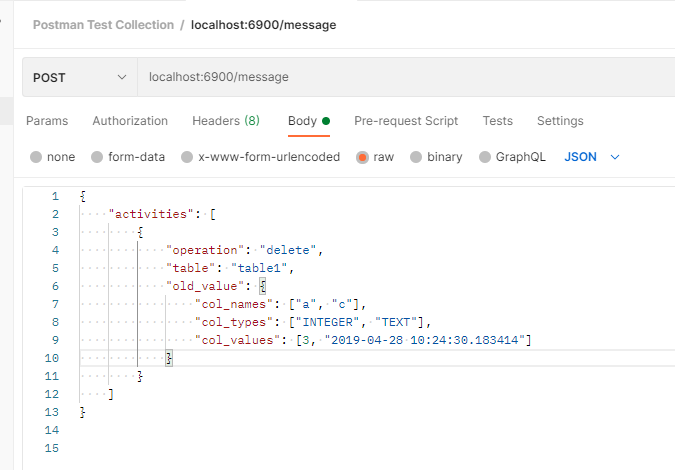
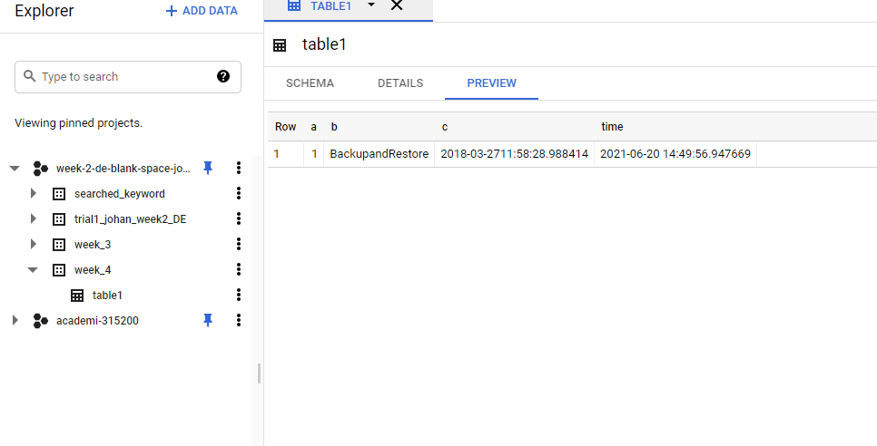
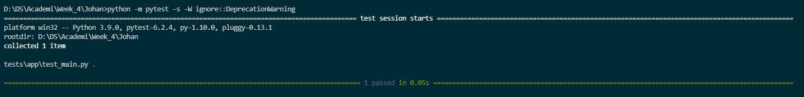

# Week 4 Gatekeeper API and Google PubSub

Gatekeeper is just a term for validation of an input data. If the input data is valid (as per requirements), the gatekeeper API will open the 'gate' and proceed the data into the next step.  
In this case, we are given a task to track any user activity data. But, the backend engineer team was not allowed us to touch their databases, in case any harm or error occured. So, we are given a json file that containing all user data activity. For this case, we are only using activity 'insert' and 'delete'. What is more important is how to transfer it using PubSub program and transfer the result into the database immediately. I am going to use Flask for the API, and Google Pub/Sub for the software that helps this activity works.

### Requirements
- GCP Account
- Postman
- Some helping libraries such as datetime, os, etc. They all attached in the requirements.txt

### Installation
- Create a credentials key as an __owner__ (this is the safest way, that you able to access all the data in your GCP account)
- Clone this `https://github.com/Johanklemantan/Week-4-Gatekeeper-API-and-Google-PubSub-to-BigQuery.git`
- Download `postman` from <a href='www.postman.com'>here</a> and follow this <a href='https://www.guru99.com/postman-tutorial.html'>tutorial</a>

### How to Use
- Place that credentials key in a specified folder and rename it. I suggest rename it to `key.json`
- I am using `Windows`. So open command prompt from your favourite IDE and set your credentials by typing 
 `set GOOGLE_APPLICATION_CREDENTIALS=key.json`
- Type `bash pubsub.sh`. This will create topic and subscription (only 1) at your Google Pub/Sub Account
- Activate the API by typing `python -m app.main`. This will initate your API on the localhost that you set
- After creating postman account, go into `POST` and type your localhost  
  
- Before tapping `SEND`, go back into your command prompt and type `python -m app.sub1`. This will initiate everything. From the checking of the data types, values, you can also modify everything, from the initial format, adding new column in your BigQuery Table output later
- After running that file, the output will be `Listening to messages on {your pubsub file project}`. Then, go to postman and press send. At this listening state, Google PubSub will listening to everything that published from the postman, as long as the format is correct. For the sake of learning, I am setting this program only listen for 30s. You can modify as per your need. 
- Since this operation only consist of `insert` and `delete`, so, some criteria in BigQuery is following this rule : 
  - Insert: if the table is not yet available in the db, it will be created accordingly with the fields. 
  - Insert: if the table is already available in the db, but the relevant field does not exists, it will alter table to add relevant field. 
  - Delete: if the table is not available, it will fail the entire transaction and output error. 
- The output will be a BigQuery Table with the message created from the `postman` earlier.
 
- For the Unit Test, type `python -m pytest -s -W ignore::DeprecationWarning` in the command prompt. It will initiate tests that verify whether the API is run, when the input code is correct, and when the input code is incorrect.
- When the result is like this,  
 
That means the test run has been successfull.

### Improvement
- For more improvement, we are able trying to do a load test, and then visualize the result (RPS, count of success, or count of fail of requests, daily, hourly, etc). But, the main field of this task, is to do a PubSub activity from end to end.

#### Thankyou and Happy Coding
